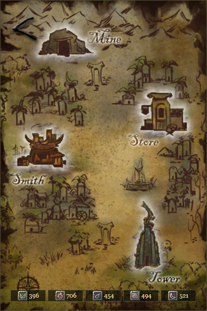
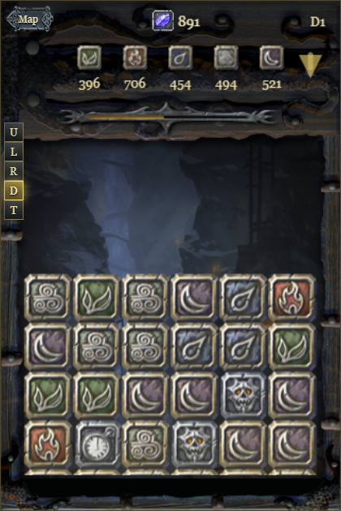

# Aurora Feint Browser Remake

A standalone browser remake prototype of `Aurora Feint: The Beginning`, rebuilt from the extracted iOS 1.0.0.1 assets in this workspace.

This project is a preservation-minded fan remake/prototype. It is not affiliated with the original developers or rights holders.

<p align="center">
  
  
</p>

## Play

Open:

```text
web/index.html
```

The remake is static HTML/CSS/JS, so no build step or local server is required.

## Current Scope

- Original map, character portraits, mine/smith/tower backgrounds, block sprites, UI images, and converted sound effects are wired in.
- Mine mode includes difficulty selection, the four-row opening rise, Panel de Pon-style swapping, horizontal/vertical matching, animated falling blocks, directional gravity, tilt controls, combos, crystals, resources, collapse rules, and tool blocks after crafting.
- Store mode includes tools, books, owned items, resource costs, crystal costs, and purchase/unlock flow.
- Smith mode includes blueprint forging, timed mining challenges, resource targets, failure surcharges, crafted tools, and tool mastery upgrades.
- Tower mode includes one-time orb puzzles with limited moves, gravity/tilt-aware layouts, solved-book tracking, and essence mastery rewards.
- RPG UI includes Your Party, Inventory, Community, character detail pages, tool mastery levels, essence mastery levels, and persistent progression.
- Audio uses original converted IPA sound effects where available, with a browser synth fallback for music.

## Controls

- Mine blocks: drag or swipe adjacent blocks to swap.
- Mine gravity: use the `U`, `L`, `R`, and `D` buttons to tilt the board.
- Sensor tilt: use `T` to enable device-orientation input when the browser allows it.
- Tower puzzles: move orb rows/columns and use tilt controls to solve the limited-move puzzle.

## Project Layout

```text
web/
  index.html
  styles.css
  game.js
  assets/
docs/
  screenshots/
tools/
  convert-ios-pngs.cjs
  convert-caf-ima4-to-wav.cjs
  test-board-matching.cjs
```

## Asset Conversion

The original iPhone PNGs use Apple's CgBI PNG optimization, which ordinary browser decoders reject. Converted browser-ready copies live in `web/assets`.

To regenerate PNG assets:

```text
node tools/convert-ios-pngs.cjs
```

The original CAF/IMA4 sound effects can be regenerated as browser-playable WAV files with:

```text
node tools/convert-caf-ima4-to-wav.cjs
```

## Checks

```text
node --check web/game.js
node tools/test-board-matching.cjs
```
